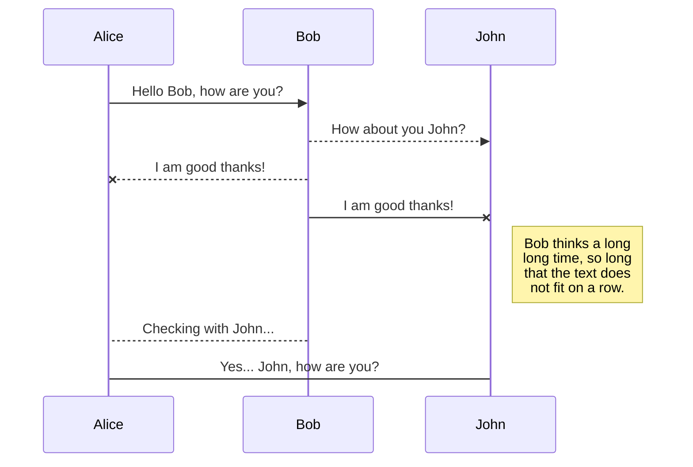
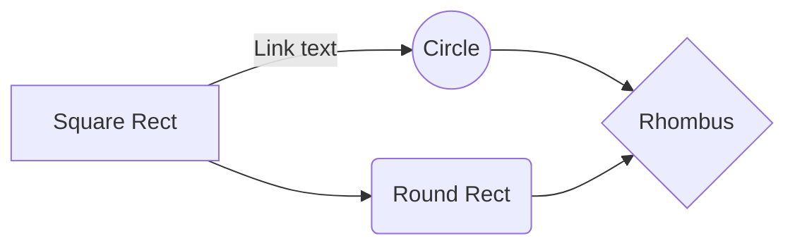

# Kids Team Theme for Wordpress

This theme is created for the Wordpress-powered Website from kids-team.at/de/ch. It tries to combine newest technology like webpack and twig (via Timber) with a clear, class-based structure. This document may be a guideline for anyone who works on the page.

## Configuration

Things like theme-support, widgets, custom post types, taxonomy or the admin interface can be set in simple PHP arrays in the config folder. Just browse there to get a hint. Many things can be adjusted there without having to dive into the source code.

## twig Templates

This theme uses the twig template engine. It unilizes the awesome Timber-Component. You do not need to install the timber-plugin, as it is included by composer. 

## Class based structure

To avoid "spaghetti code", most functions are put in classes, so we have a clean and simple functions.php.

## Webpack

For development, webpack and browser-sync may be good accompany. Simply run

    npm install

in the assets folder, then stat theming with ES6 and SASS.

## UML diagrams

You can render UML diagrams using [Mermaid](https://mermaidjs.github.io/). For example, this will produce a sequence diagram:

And this will produce a flow chart:

